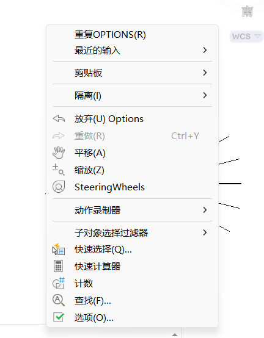
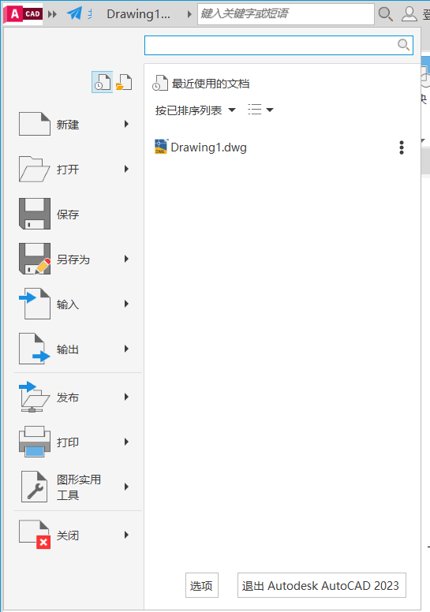
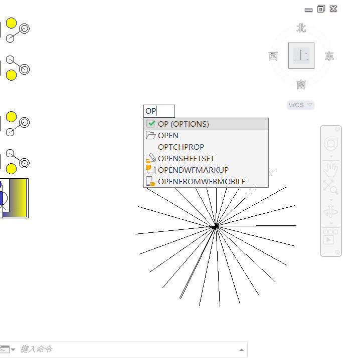

#### 1.打开选项的方法

第一种、鼠标在空白区域右击

第二种、点击左上角红色CAD图标

第三种、键盘输入op 回车

#### 2.界面缩放

滚动鼠标滚轮可以放大缩小

#### 3.范围缩放

键盘输入z+空格或者点击右边的工具栏范围缩放,回到图像的正中央。

#### 4.小抓手 

键盘输入p+空格。或者右边工具栏点击小抓手, 按下鼠标滚轮也可实现。

#### 5.L直线指令

鼠标点击即可产生线条，两个点以上时可以C空格直接闭合。执行闭合指令后，不点击直接空格会衔接到上一条线端点。并且可以和圆弧A指令快速衔接(相切)

C闭合功能属于二级指令，在线条类指令中，符合条件时才会出现

(ML多线、PL多线段、SPL样条曲线、L直线)

#### 6.F8正交模式 与 F10极轴追踪模式

正交模式开启后，光标的编辑方向会被限制在水平/垂直的轴向上，还可以利用UCS用户坐标，控制正交的方向，UCS空格两下可以恢复(PLAN空格两下，正视于当前坐标)

极轴追踪模式开启后，光标不会被限制方向，而是从上一个点，延伸出虚线，与光标进行对齐和追踪。增量角：为每两根虚线之间的夹角；附加角：一个角只对应一根虚线，可以设置多个角度，适应特定制图需求。

#### 7.PL多段线指令

基本用法与L直线一致，只不过最终得到的线条为粘连在一起的整体线条，不会分段，可以使用**x**分解成直线

W宽度：可以指定当前线段的头+尾线宽

H半宽：与W宽度用法一致，只输入一半数智

A圆弧/L直线：同一段多段线，可以切换圆弧/直线模式绘制

L长度：线性增加长度，不会转向

#### 8.REC矩形指令

绘制：先指定第一个点，再输入D空格(尺寸)，先输入长度，再输入宽度，最后用光标控制矩形的朝向，点击即可绘制出矩形

形状修改：在定点之前，有C倒角、F圆角等功能使用，其中标高、宽度、厚度是不常用的，不用学

R角度：可以赋予矩形绘制时的角度值

A面积：先输入面积在输入其中一条边

#### 9.M移动指令

先选择对象，空格确定后，指定基点(移动点)，放到 目标位置即可。

#### 10.F11对象捕捉追踪

开启后，光标可以在捕捉点上停留，即可从该点延申出虚线，与光标进行对齐和追踪。

#### 11.TK连续追踪点

属于辅助指令，不能单独使用，要在其他指令执行中，需要顶点定位的时候，输入TK空格，然后点击出发点，光标控制方向，输入追踪距离，到达目标位置后，空格或者回车结束最终。

追踪效率提升：TK追踪方向会自动转弯，朝向鼠标位置，所以可以点击出发点后，光标直接放到目标位置附近，然后连续输入距离，即可快速定位。

#### 12.C圆形指令

基本画法：指定圆心，输入半径(D直径),3P三点画圆、2P两点画圆、T切点切点半径画圆。以及图标下拉条的三相切画圆(tan×3) 。第二个圆@空格可以快速绘制同心圆

角度替代功能

在需要定点定方向的指令中，输入小于号和角度值，例如<60、<30，即可将光标的编辑方向限制在改角度方向上。角度值的输入，遵循“逆正顺负”规律(小于号输入：按住shift+逗号)c 

#### 13.O偏移指令

先指定偏移距离，再选择对象，光标控制方向，点击即可产生线条，两种指定偏移距离的方法：

1. 直接输入偏移数值
2. 用鼠标拾取图纸中两点之间的距离，可以连续多次偏移，也可以M多个快速偏移等距

T通过：若不知道偏移距离，可以使用该功能，由光标确定偏移到的位置点。

E删除：偏移后是否删除原位置对象，默认不删。

L图层：决定偏移出的新线条归属图层(不常用)

#### 14.TR修剪指令

新版CAD：TR空格一下，即可开始修剪，如需要改回标准了模式，可以TR空格O空格，输入S空格即可改回标准模式。

简易修剪：适用于图形线条较少的情况，输入TR空格两下，哪里不要点哪里

常规修剪：先选择剪切便(起点终点的线条)，输入TR空格，开始修剪图形

#### 15.角度替代功能

需要在顶点定方向的指令中，输入小于号和角度值，例如<60、<30,，即可将光标的编辑方向限制在改角度方向上

角度值的输入，遵循“逆正顺负”规律(小于号输入：按住shift+逗号)

#### 16.RO旋转指令

先选择对象，空格确定后，指定基点(旋转中心点)

C复制：保留原位置的对象

输入角度(遵循“逆正顺负”的规律)

R参照：可以忽略角度加减关系，从基点护法指定一段角度，为期重新输入角度值

#### 17.EX延伸指令

操作原理，与TR修剪指令均一直，并且和TR修剪指令具有互通性。可以在修改图形时，按住shift键，实现切换无需重新输入指令。

#### 18.F圆角指令

基本用法：通过R空格，设置半径值，选择两条边进行圆角操作

T修剪模式:默认开启，具有“长修短补”功能，当R=0或者按住shift键，则可以用拐角修补(修剪、延伸、补角三合一的功能)

当两条边平行时，无需R半径，直接选择两条边，进行完全圆角(圆弧封口，半圆包边：条形孔、腰形槽、U形槽等)

M多个模式：可以连续进行圆角，不中断，中途可以修改R半径

P多段线：可以对多段线对象，进行批量圆角/取消圆角/修改圆角操作

(注：若对象不是多段线，可以用J合并指令或者PE编辑多段线指令，转化为多段线)

#### 19.AR阵列指令

分为高低版本阵列

(低版本为经典窗口界面，高版本为功能区+命令行+图形操作)

矩阵阵列：

主要指定阵列数量，以及对象间距(总距)

环形阵列/极轴阵列：

主要指定阵列数量，以及角度和方法

三种方法：

1. 总角度和数量
2. 夹角和数量
3. 总角度和夹角

路径阵列(仅限高版本阵列)

主要指定阵列数量、路径曲线、方法

两种方法：

1. 定数等分：曲线+数量
2. 定距等分：曲线+间距

高低版本的功能差别：

1. 高版本还可以利用图形夹点修改
2. 高版本开启关联性后可以二次修改
3. 低版本具有矩阵角度输入

#### 20.POL多边形指令

三种画法

A：输入边数，指定中心点，选择画法

1. 内接于圆 i:已知对角距离/角到中心距离
2. 外接于圆C:已知对边距离/边到中心距离

B：输入边数，E空格，选择边(从左往右点生成在上方)

还有一种更直观的画法，就是先画圆形，再画多边形

#### 21.EL椭圆指令

两种画法

1. 先指定两个轴端点，再输入半轴
2. C空格，先指定中心点，再指定半轴端点，再输入半轴

再输入半轴

椭圆弧A，则是EL空格A空格后，按照以上画法，完成椭圆绘制后，指定椭圆弧的起点，以逆时针的方式获得弧。

隐藏功能：等轴测圆EL -i

在开启等轴测画图模式时才会出现，按**F5**切换圆形平面方向。

#### 22.UCS用户坐标

改变当前坐标位置。先指定原点，再指定xy轴方向

输入UCS空格两下，可以恢复到世界坐标

输入PLAN空格两下，可以正视于当前坐标系(z轴方向由右手方向确定)

#### 23.AL对齐指令

先选择对象，空格确定后，开始对齐

对齐过程：先点击对象上的源点，再点击目标点的位置

如果是二维图形，只需要对齐两次，第三次空格跳过即可

如果是三维模型，带有空间角度偏离，则对齐三次

最后的提示：是否基于对齐点缩放，是Y，空格否a

#### 24.夹点编辑法

夹点——选择对象后，出现的蓝色方块点鼠标点击后，就可以开始拉伸，此时进入了“夹点编辑模式”

按空格键，即可切换夹点编辑的功能

1. 点击激活：拉伸
2. 空格一下：位移
3. 空格两下：旋转
4. 空格三下：缩放
5. 空格四下：镜像
6. 继续空格进入循环功能

C复制：进入多重编辑模式，可以连续输入数值不会中断

R参照：用法等同于RO旋转参照、SC缩放参照

U放弃：等同于ctrl+Z撤回

B基点：重新指定编辑点位置

#### 25.磁吸效应

光标再执行指令中定点时，靠近图形，会出现捕捉点，此时光标的下一次点击以及当前的追踪方向，都会被该点吸附，默认开启此功能，无需设置(关闭：OP空格，绘图设置)

负值输入：

长度、角度、半径均可以输入负值

长度：切换方向，走反向

角度：切换方向，走顺时针

半径：圆弧A指令，切换优弧劣弧

#### 26.CO复制指令

先选择对象，空格确定后，指定基点(移动点)，放置到目标位置即可

可以多次点击连续摆放对象

CO-A阵列：

为建议版阵列，快速阵列

先输入数量，再输入间距(F布满总距)

#### 27.CHA倒角指令

D距离：输入距离1，距离2，再去选择两条边进行倒角(按输入顺序选择)

A角度：先输入距离1，再输入角度，再去选择两条边进行倒角(先选择距离边)

T修建模式：与F圆角指令一样

当距离都为0，或者按住shift键，可以用于拐角修补

M多个：可以连续不中断进行倒角操作

P多段线：可以对多段线对象，进行批量倒角

28.圆弧A指令

基本画法：三点画圆弧，依次点击三点即可(如果不满三个点，则切换条件)

条件画法：根据已知条件，在命令行中，选择合适的已知类型画法，去绘制所需圆弧

起点、端点、圆心c、半径R、角度A、弦长L、方向D

逆时针画弧：圆弧大部分画法要遵循逆时针绘制

(D方向绘制起点相切圆弧、三点画圆除外)

高版本可以按住Ctrl键切换方向，但是无法输入数值

优弧劣弧：半径输入负数可以获得优弧

