## 一、单片机简介

### (一)、单片机是什么？

单片机：Single-Chip-Microcomputer,单片机微型计算机，是一种集成电路芯片。它的特点是体积小、功耗低、集成度高、使用方便、拓展灵活。

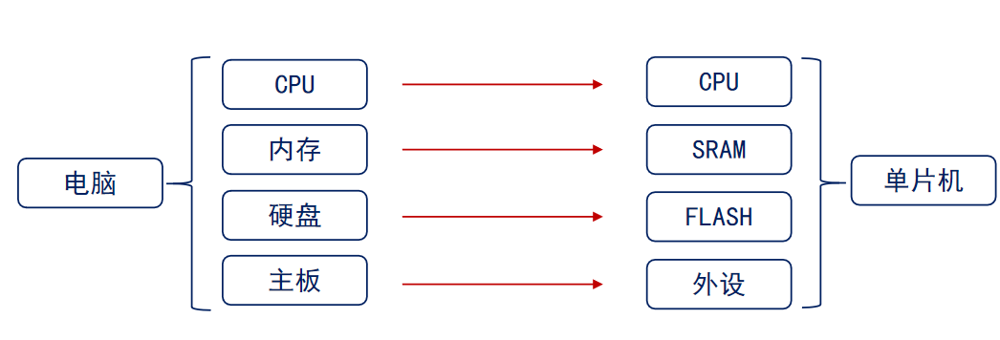

### (二)、单片机有什么用？

仪表仪器：电源、示波器、焊台

家用电器：空调、冰箱、洗衣机

工业控制：机器人、PLC、电梯

汽车电子：GPS、ABS、胎压监测

### (三)、单片机的发展历程

从时间角度来看，第一阶段是**探索阶段**(1976~1978):MCS-48、第二阶段**完善阶段**(1978~1982):MCS-51、第三阶段**向微控制器发展阶段**(1982~1990):MCS-96、第四阶段**微控制器全面发展阶段**(1990~现在):ARM、RISC-V。

从产品目的来看，**SCM单片微型计算机阶段**：单片形态、**MCU微控制器阶段**：完善控制。**SoC嵌入式系统阶段**：软硬件协同设计。

### (四)、单片机发展趋势

CPU：主频高、64位、双CPU、流水线

存储器：MB级、片内ROM开始FLASH化、程序加密化

IO：提高并行驱动能力、增加IO功能

外围电路内置化(提高集成度)：DMA、AD、DA、液晶驱动等内置到片内

品种多样化：低功耗化、微型化、低价格、专用化

### (五)、CISC VS RISC

| 对比项   | 复杂指令集计算机(CISC)                                       | 精简指令集计算机(RISC)                                       |
| -------- | ------------------------------------------------------------ | ------------------------------------------------------------ |
| 目的     | 为了便于变成和提高存储器访问效率                             | 为了提高处理器运行速度                                       |
| 指令特点 | 1、指令多，模式多，格式可变 2、指令的执行需要的时钟周期差距很大 3、无流水线活流水线程度较低 4、指令由微代码翻译执行 | 1、指令少，模式少，格式固定 2、大多数指令只需要1个时钟周期 3、流水线结构 4、指令直接由硬件执行 |
| 优点     | 1、指令丰富、功能强大 2、寻址方式灵活                   | 1、指令精简，易于设计，使用率均衡 2、程序执行效率高     |
| 缺点     | 1、指令使用率不均衡 2、不利于采用先进结构提高性能 3、结构复杂不利于超大规模集成电路实现 | 1、指令数较少，功能不及CISC强大 2、寻址方式不够灵活     |

## 二、Cortex-M系列介绍

### (一)、ARM公司

1. ARM公司只做芯片架构与处理器核的设计与IP授权，不参与芯片设计。全球几乎所有手机、绝大多数嵌入式与loT设备，都用Arm架构。
2. 核心IP产品线
   - CPU处理器核
     - Cortex-A：高性能，手机/平板/PC(如苹果A系列、晓龙8系)
     - Cortex-R：实时控制、汽车电子、工业控制
     - Cortex-M：低功耗，loT、MCU、传感器、可穿戴 （**我们现在所学**）
     - Neoverse：服务器/数据中心/AI算力
   - GPU/多媒体IP：Mail系列，用于图形、视频、AI推理
   - 系统IP/物理IP：总线、内存控制器、安全模块、工艺库
   - 计算子系统(CSS)：预集成CPU+中线+安全，帮客户快速做芯片

### (二)、Cortex内核分类及特征

| 对比项   | Cortex-A(Application)                  | Cortex-R(Real-time)                  | Cortex-M(Microcontroller)                  |
| -------- | -------------------------------------- | ------------------------------------ | ------------------------------------------ |
| 特点     | 高时钟频率，长流水线，高性能           | 较高时钟频率，较长的流水线，实时性强 | 时钟频率低，通常较短的流水线，超低功耗     |
| 应用场景 | 移动计算、智能手机、平板电脑、数字电视 | 军工、汽车电子、无线基带、硬盘控制器 | 工控、传感器、消费电子、家用电器、医疗器械 |

### (三)、cortex-M3/4/7介绍

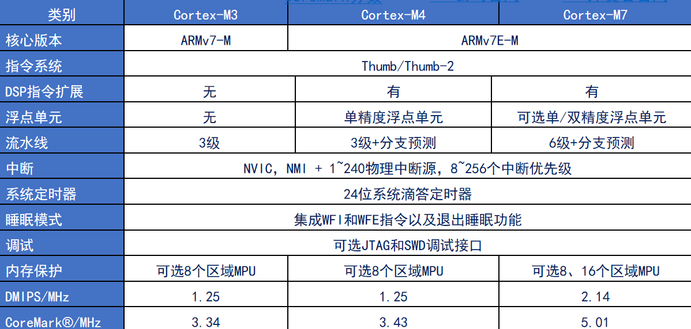

## 三、了解STM32

### (一)、STM32是什么？

STM32是最常用、最火的一类单片机(MCU)，有意法半导体(ST)公司出品，内核用的就是ARM。

ST累计推出了：5大类、18个系列、1000多个型号的Cortex内核微控制器。

### (二)、STM32分类

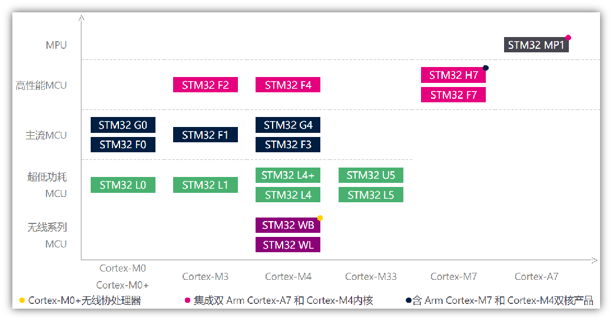

### (三)、STM32命名规则

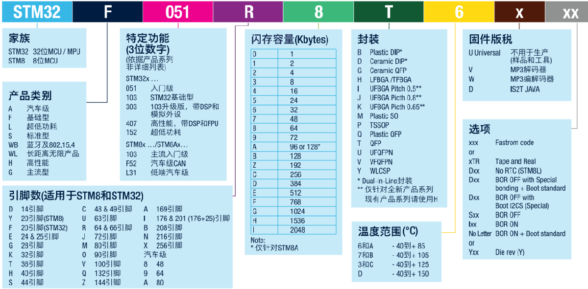

### (四)、STM32选型

由高到低，由大到小

## 四、STM32原理图设计

(一)、数据手册查看方法

1. 获取方式

   ST官网：https://www.st.com

2. 数据手册内容概要

   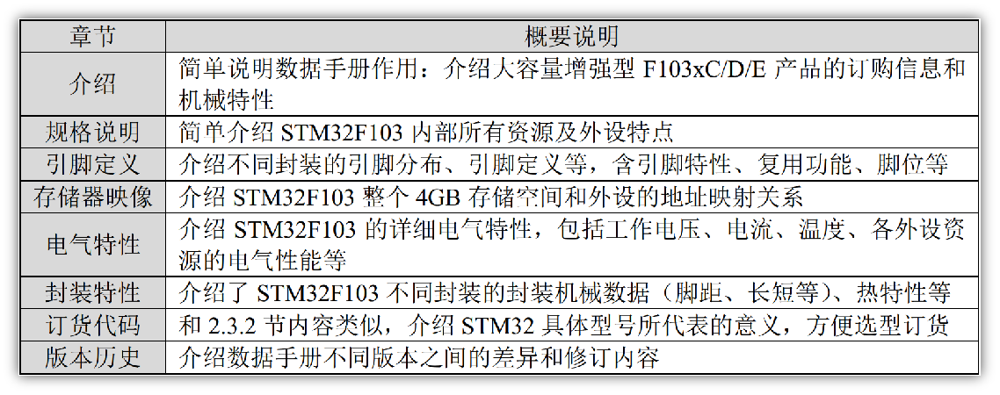

3. STM32F103ZET6引脚分布

   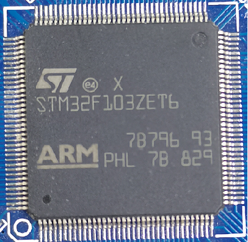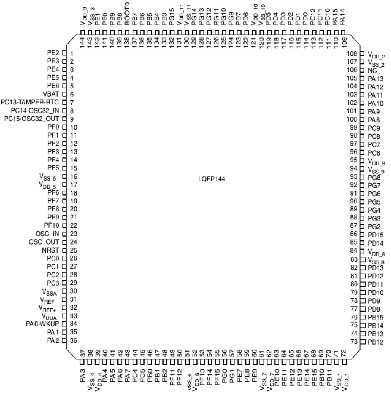

   STM32引脚类型：
   电源引脚、晶振引脚、复位引脚、
   下载引脚、BOOT引脚、GPIO引脚

4. 下载接口

   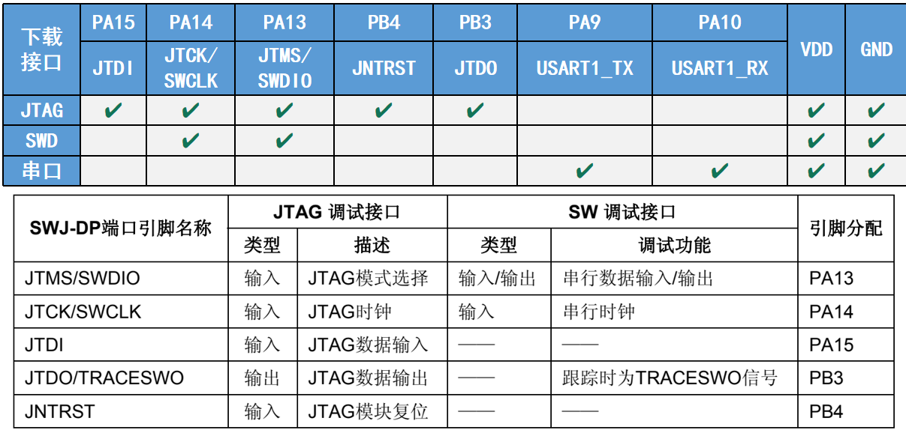

(二)、最小系统

保证MCU正常工作的最小电路组成单元

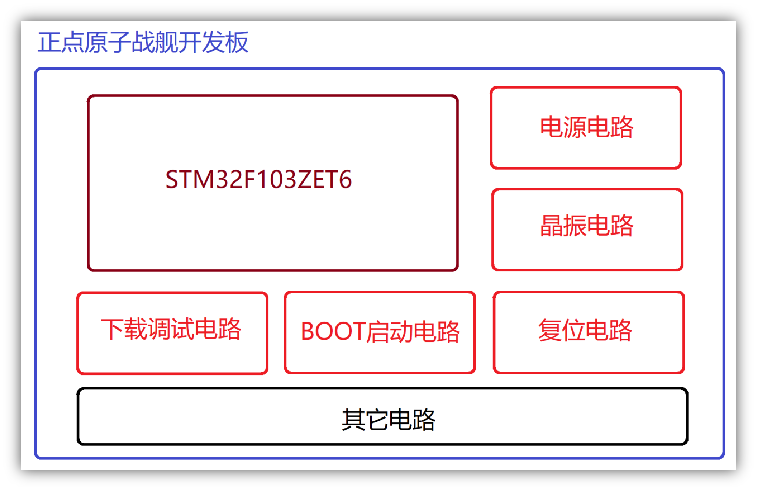

(三)、IO分配

优先分配特定外设IO，然后分配通用IO，最后微调。

## 五、搭建开发环境

### (一)、常用开发工具简介

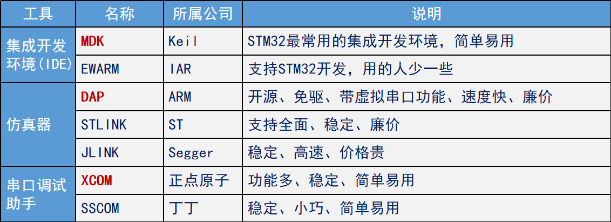

### (二)、安装MDK

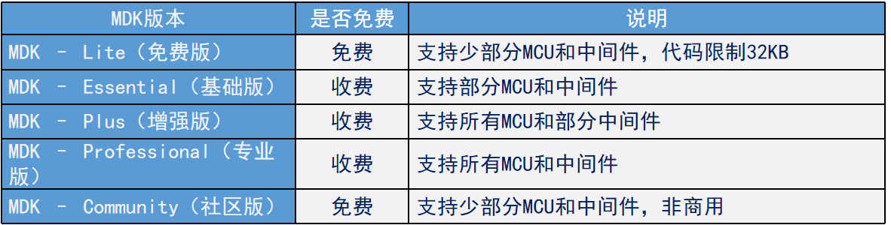

### (三)、安装仿真驱动器

### (四)、安装CH340 USB虚拟串口驱动

为什么要安装CH340 USB虚拟串口驱动？

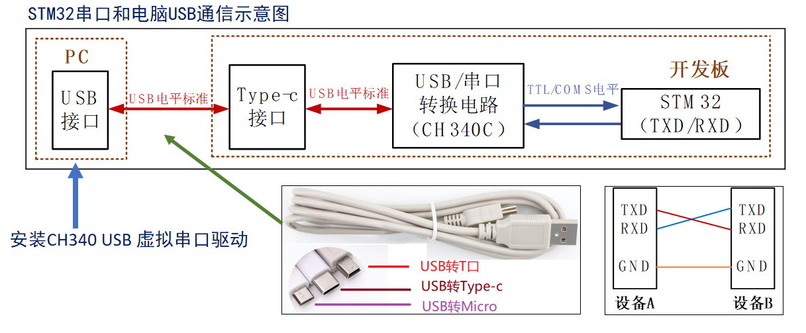