## 一、单片机简介

### (一)、单片机是什么？

单片机：Single-Chip-Microcomputer,单片机微型计算机，是一种集成电路芯片。它的特点是体积小、功耗低、集成度高、使用方便、拓展灵活。

### (二)、单片机有什么用？

仪表仪器：电源、示波器、焊台

家用电器：空调、冰箱、洗衣机

工业控制：机器人、PLC、电梯

汽车电子：GPS、ABS、胎压监测

### (三)、单片机的发展历程

从时间角度来看，第一阶段是**探索阶段**(1976~1978):MCS-48、第二阶段**完善阶段**(1978~1982):MCS-51、第三阶段**向微控制器发展阶段**(1982~1990):MCS-96、第四阶段**微控制器全面发展阶段**(1990~现在):ARM、RISC-V。

从产品目的来看，**SCM单片微型计算机阶段**：单片形态、**MCU微控制器阶段**：完善控制。**SoC嵌入式系统阶段**：软硬件协同设计。

### (四)、单片机发展趋势

CPU：主频高、64位、双CPU、流水线

存储器：MB级、片内ROM开始FLASH化、程序加密化

IO：提高并行驱动能力、增加IO功能

外围电路内置化(提高集成度)：DMA、AD、DA、液晶驱动等内置到片内

品种多样化：低功耗化、微型化、低价格、专用化

### (五)、CISC VS RISC

| 对比项   | 复杂指令集计算机(CISC)                                       | 精简指令集计算机(RISC)                                       |
| -------- | ------------------------------------------------------------ | ------------------------------------------------------------ |
| 目的     | 为了便于变成和提高存储器访问效率                             | 为了提高处理器运行速度                                       |
| 指令特点 | 1、指令多，模式多，格式可变 2、指令的执行需要的时钟周期差距很大 3、无流水线活流水线程度较低 4、指令由微代码翻译执行 | 1、指令少，模式少，格式固定 2、大多数指令只需要1个时钟周期 3、流水线结构 4、指令直接由硬件执行 |
| 优点     | 1、指令丰富、功能强大 2、寻址方式灵活                   | 1、指令精简，易于设计，使用率均衡 2、程序执行效率高     |
| 缺点     | 1、指令使用率不均衡 2、不利于采用先进结构提高性能 3、结构复杂不利于超大规模集成电路实现 | 1、指令数较少，功能不及CISC强大 2、寻址方式不够灵活     |

## 二、Cortex-M系列介绍

### (一)、ARM公司

1. ARM公司只做芯片架构与处理器核的设计与IP授权，不参与芯片设计。全球几乎所有手机、绝大多数嵌入式与loT设备，都用Arm架构。
2. 核心IP产品线
   - CPU处理器核
     - Cortex-A：高性能，手机/平板/PC(如苹果A系列、晓龙8系)
     - Cortex-R：实时控制、汽车电子、工业控制
     - Cortex-M：低功耗，loT、MCU、传感器、可穿戴 （**我们现在所学**）
     - Neoverse：服务器/数据中心/AI算力
   - GPU/多媒体IP：Mail系列，用于图形、视频、AI推理
   - 系统IP/物理IP：总线、内存控制器、安全模块、工艺库
   - 计算子系统(CSS)：预集成CPU+中线+安全，帮客户快速做芯片

### (二)、Cortex内核分类及特征

| 对比项   | Cortex-A(Application)                  | Cortex-R(Real-time)                  | Cortex-M(Microcontroller)                  |
| -------- | -------------------------------------- | ------------------------------------ | ------------------------------------------ |
| 特点     | 高时钟频率，长流水线，高性能           | 较高时钟频率，较长的流水线，实时性强 | 时钟频率低，通常较短的流水线，超低功耗     |
| 应用场景 | 移动计算、智能手机、平板电脑、数字电视 | 军工、汽车电子、无线基带、硬盘控制器 | 工控、传感器、消费电子、家用电器、医疗器械 |

### (三)、cortex-M3/4/7介绍

## 三、STM32基础知识

### (一)、STM32是什么？

STM32是最常用、最火的一类单片机(MCU)，有意法半导体(ST)公司出品，内核用的就是ARM。

ST累计推出了：5大类、18个系列、1000多个型号的Cortex内核微控制器。

### (二)、STM32分类

### (三)、STM32命名规则

### (四)、STM32选型

由高到低，由大到小

### (五)、STM32原理图设计

#### (1)、数据手册查看方法

1. ##### 获取方式

   ST官网：https://www.st.com

2. ##### 数据手册内容概要

   

3. ##### STM32F103ZET6引脚分布

   

   STM32引脚类型：
   电源引脚、晶振引脚、复位引脚、
   下载引脚、BOOT引脚、GPIO引脚

4. ##### 下载接口

   就是把程序从电脑烧进单片机的接口和工具，这部分可以拆分成两层：
   
   - 底层协议：芯片和仿真器之间的通信规则(SWD/JTAG)
   - 上层工具：电脑和芯片之间的桥梁(DAP/ST-link/J-Link)
   
   

#### (2)、最小系统

保证MCU正常工作的最小电路组成单元

#### (3)、IO分配

优先分配特定外设IO，然后分配通用IO，最后微调。

## 三、搭建开发环境

### (一)、常用开发工具简介

### (二)、安装MDK

MDK5 的安装分为两步：1，安装 MDK5；2，安装器件支持包。

MDK 软件下载地址：https://www.keil.com/download/product，目前最新版本是 MDK5.36。

器件支持包下载地址：https://www.keil.com/dd2/pack，STM32F1 支持包最新版本是 2.3.0。

MDK5 的安装比较简单，具体安装步骤请参考图 3.2.1 的 **安装过程****.txt** 进行安装即可，需

要提醒一下大家，在选择安装路径的时候，强烈建议大家将 Pack 的路径和 Core 的路径放在一

个位置，比如我们安装在 D 盘（都安装在：D:\MDK5.34 路径下），如图 3.2.2 所示：

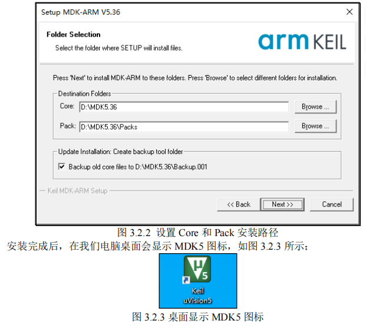

### (三)、安装仿真驱动器

仿真器 = 调试器 + 下载器

DAP仿真器免驱

ST LINK仿真器需要安装驱动器

### (四)、安装CH340 USB虚拟串口驱动

#### 1.串口是什么？

串口(Serial Port) 全称是串行通信接口，是一种让设备之间逐位、按顺序传输数据的通信方式。

常见形态：

- 硬件串口(UART/USART)
  - 单片机/开发板上最常见：TX(发送)、RX(接收)、GND(地线)
  - 比如STM32、ESP32、Arduino上的UART1/UART2引脚
  - 老电脑的9针COM口(RS-232)也是串口，现在基本被USB串口替代
- USB转串口(虚拟串口)
  - DAP仿真器里带的CDC-ACM虚拟串口
  - 电脑识别成一个COM口比如COM3，实际是USB转成了串口信号
  - 用来给单片机打印调试信息，发指令

#### 2.为什么要安装CH340 USB虚拟串口驱动？

#### 3.USB虚拟串口作用

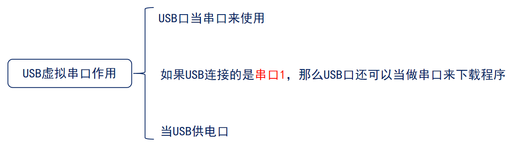

##### 串口1、串口2是什么意思？

串口1、串口2是单片机内部不同的硬件通信模块，有各自独立的引脚核寄存器。单片机里集成了多个UART/USART硬件外设，每个外设就是一个独立的”串口通道“：

- UART1/USART1->串口1
- UART2/USART2->串口2
- 有的芯片还有UART3、UART4……

##### 串口和TTL串口

① 串口是通用异步收发传输器(UART)的俗称，是一种串行通信协议，用来在设备之间逐传输数据。收发双方约定好波特率、数据位、校验位、停止位，就能互相通信。单片机、电脑、传感器之间的串口打印日志，串口调试，指的就是这个协议。

② TTL串口是基于TTL电平标准实现的串口，是串口的物理层实现形式。智能短距离通信，抗干扰能力弱。单片机、传感器、蓝牙模块等板级舍尔比之间，直接用TX/RX引脚连接的就是TTL串口。WCHLink自带的USB转TTL串口，就是把电脑的USB信号转成单片机能识别的TTL电平串口信号。

③ 它们的关系 串口(UART)是协议层，定义了怎么传数据.TTL串口是物理层，定义了用说明电压电平传数据。日常说的串口默认指的是TTL串口。

### (五)、MDK5编译例程

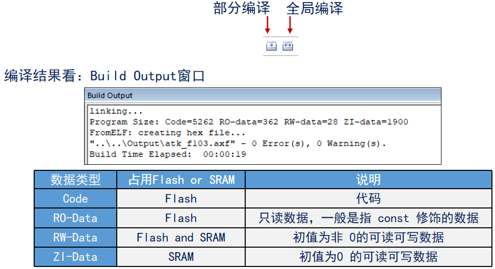

### (六)、串口下载程序

#### 1.串口下载程序须知

- M3、M4、M7开发板支持串口下载程序，但是ATK-XISP.exe软件只支持下载到内部flash

- STM32的ISP下载，常用串口1下载程序

- 因为使用USB虚拟串口，所以事先得安装CH340 USB虚拟串口驱动

- 内部flash和外部flash：

  内部flash就是单片机芯片封装内部自带的Flash存储器，和CPU在同一块硅片上，编译后生成的.hex文件就是下载到这里，并且掉电不丢失。速度极快，容量小，不需要额外的线。

  外部flash是单片机外面单独焊的一颗存储芯片，能够存储大量资源，容量大，速度慢，需要自己写驱动，成本低容量灵活。内部flash可以直接执行程序，而外部flash不能直接执行，智能先读到RAM里再运行。

#### 2.串口下载硬件连接

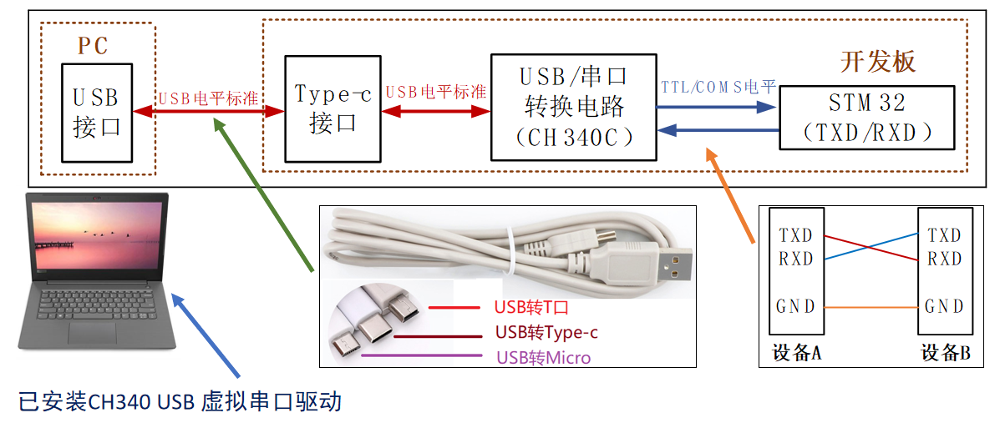

#### 3.STM32启动模式(M3和M4)

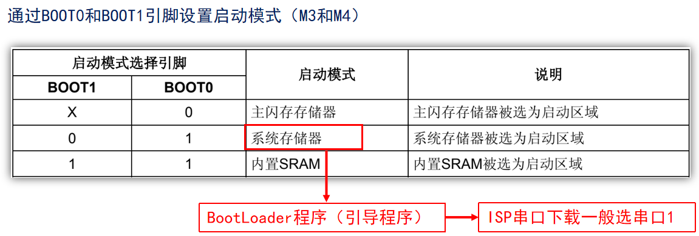

##### (1) ISP下载程序一般步骤

- BOOT0接高电平，BOOT1接低电平
- 按复位键

##### (2) 程序执行一般步骤：

- BOOT0接低电平，BOOT1接任意
- 按复位键

##### (3) 串口一键下载原理

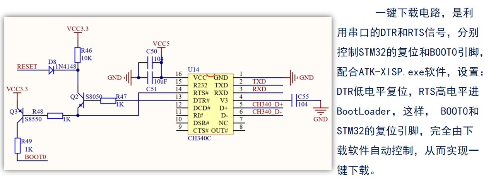

##### (4) 不使用一键下载的CH340参考电路

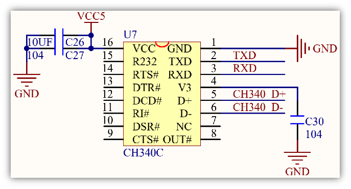

### (七)、DAP下载程序

#### 1.DAP下载硬件连接

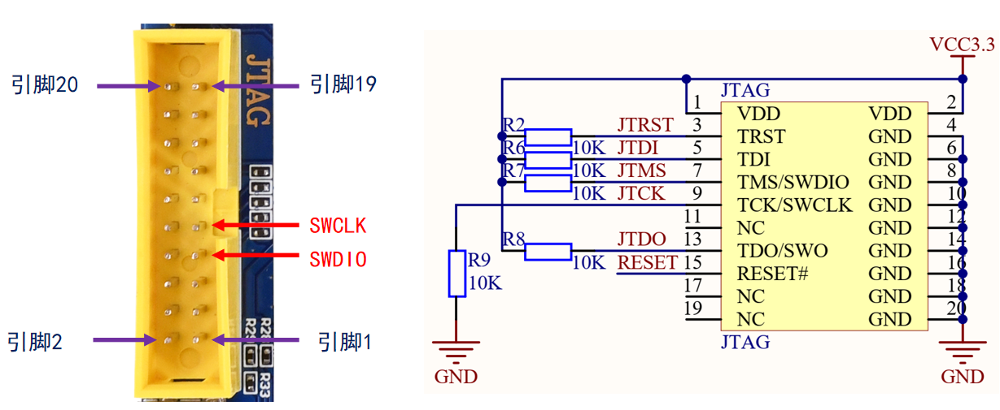

#### 2.在MDK上配置DAP

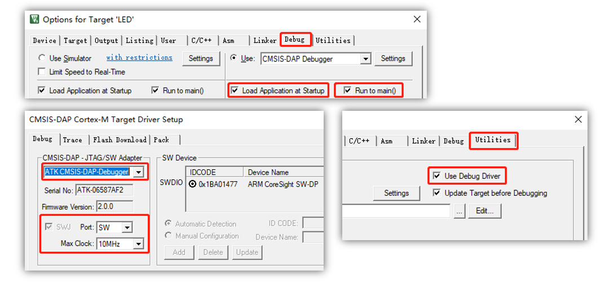

#### 3.DAP调试程序

##### (1) JTAG/SWD调试原理概述

Cortex-M内核含有硬件调试模块，该模块可在取指(指令断点)或访问数据(数据断点)时停止。内核停止时，可以查询内核的内部状态和系统的外部状态。完成查询后，可恢复程序执行。

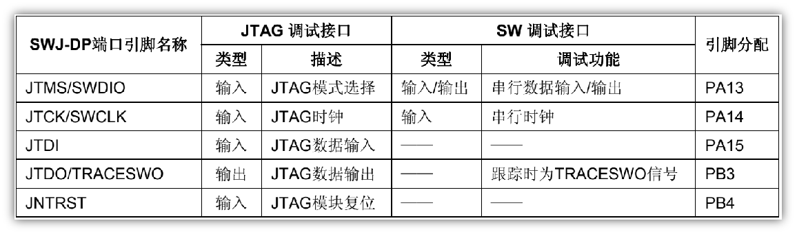

##### (2) 灵活的SWJ-DP引脚分配

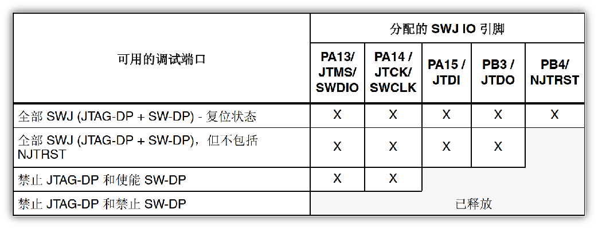

F1系列可以通过AF10_MAPR寄存器的SWJ_CFG[2:0]位来释放部分或者全部SWJ-DP引脚

F4/F7/H7系列默认全部SWJ-DP引脚复用功能并映射到复用功能0(AF0)

## 六、内核和芯片

### (一)、STM32系统框架

#### 1.Cortex M内核 & 芯片

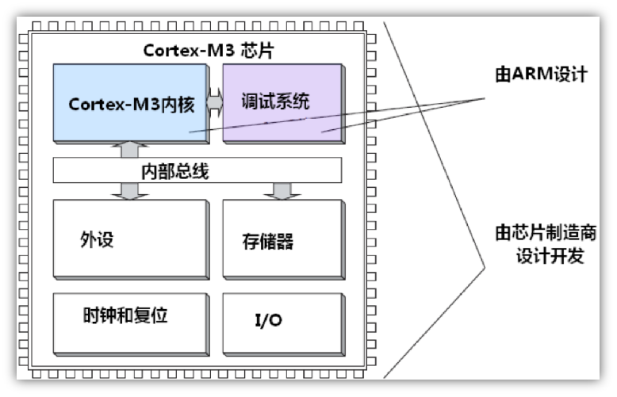

#### 2.F1系统架构

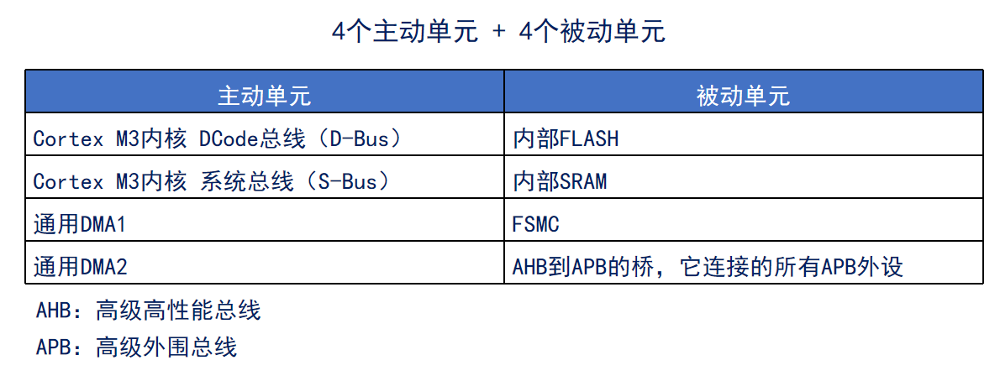

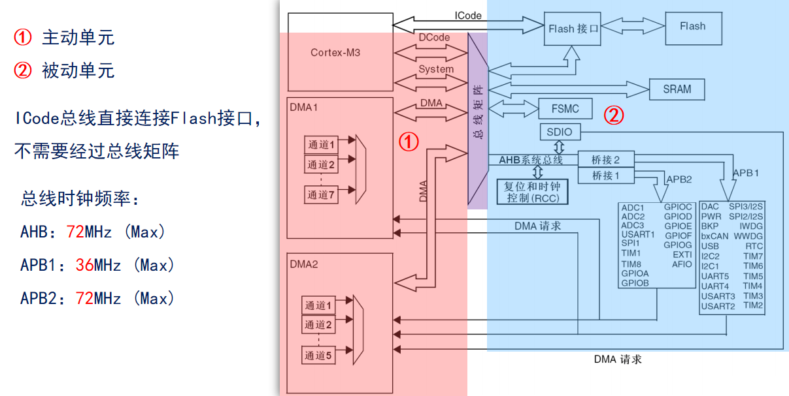

#### 3.F4系统架构

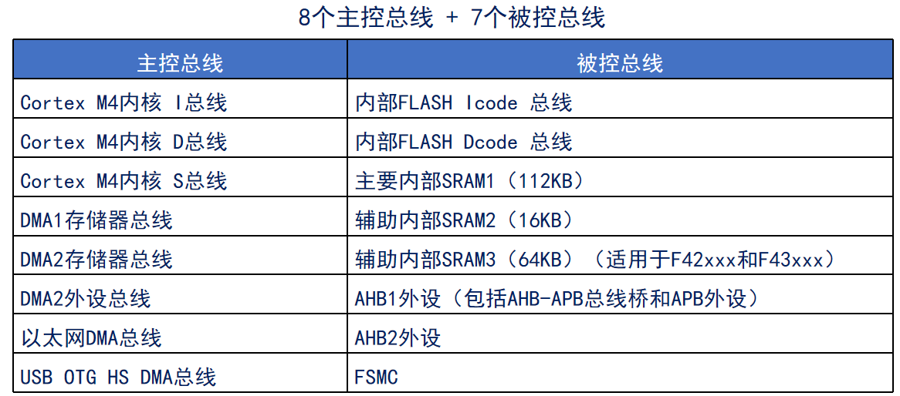

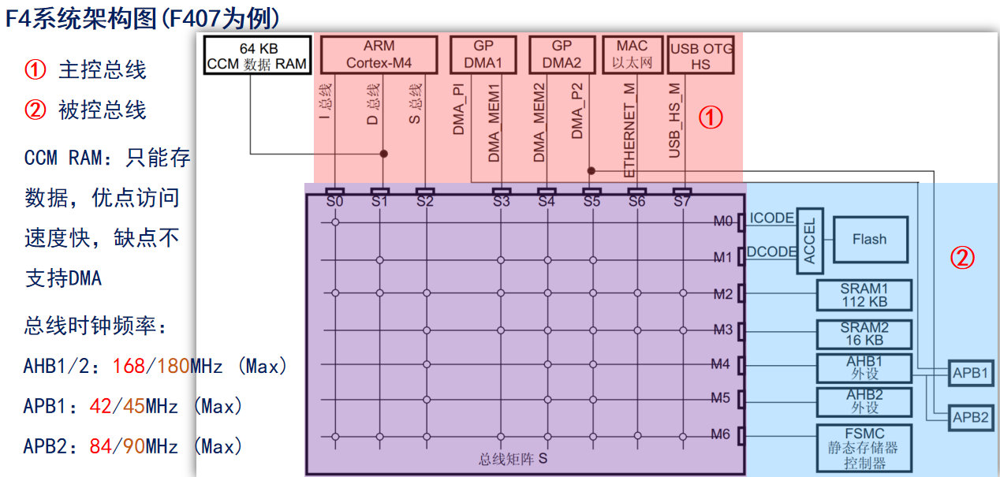

#### 4.F7系统架构

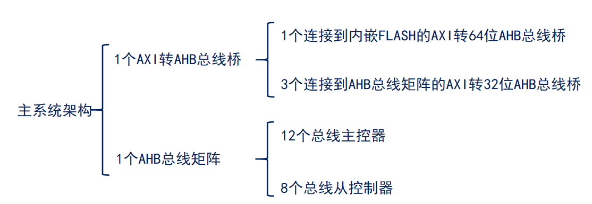

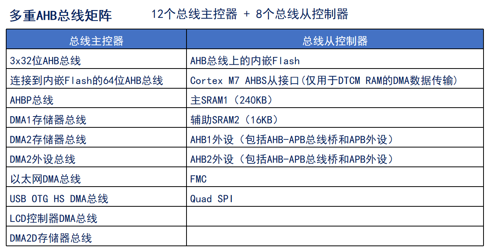

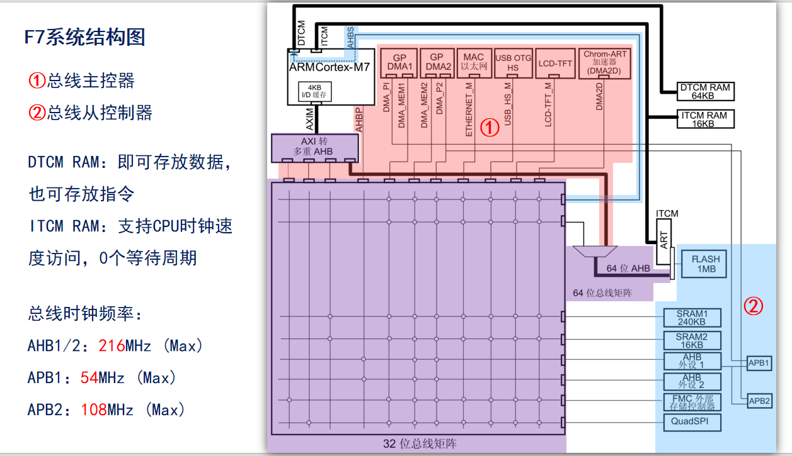

#### 5.H7系统架构

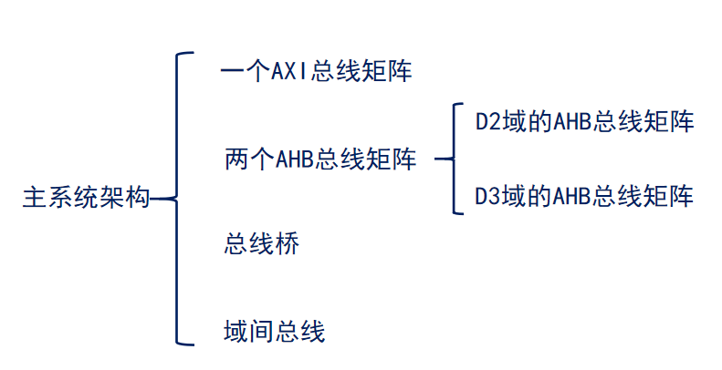

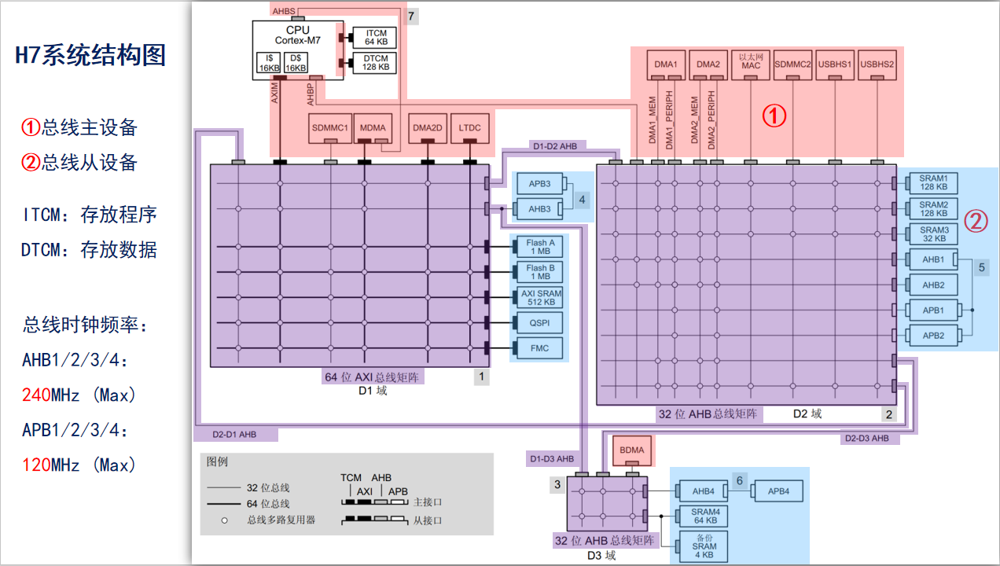

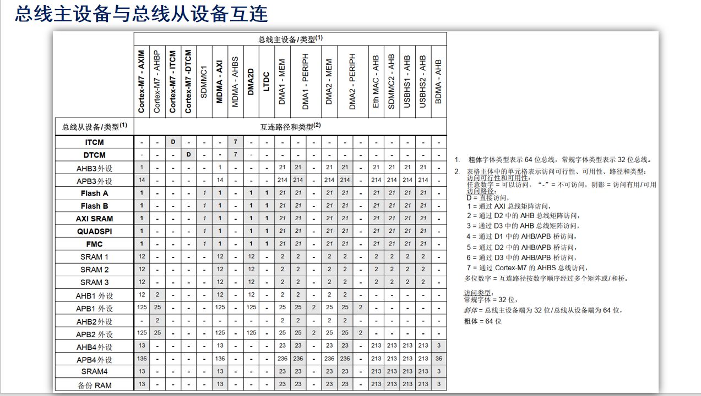

### (二)、STM32的寻址范围

32位的单片机可以有32根地址线，每根地址线有两种状态：导通或者是不导通

单片机

### (三)、存储器映射

#### 存储器(Memory)

- 作用：存放大量数据、程序代码的地方
- 特点：容量大，但是速度相对较慢
- 举例：STM32内部Flash(存储程序)、SRAM(存储变量、堆栈)
- 类比：就像一个大仓库，你可以放很多货物，但是取货需要走一段路

STM32是一个32位单片机，他可以很方便的访问4GB以内的存储空间（2^32 = 4GB），因此Cortex M3内核将图5.3.2.1中的所有结构，包括：FLASH、SRAM、外设及相关寄存器等全部组织在同一个4GB的线性地址空间内，我们可以通过C语言来访问这些地址空间，从而操作相关外设（读/写）。数据字节以小端格式（小端模式）存放在存储器中，数据的高字节保存在内存的高地址中，而数据的低字节保存在内存的低地址中。

**存储器本身是没有地址信息的，我们对存储器分配地址的过程就叫存储器映射**。这个分配一般由芯片厂商做好了，ST将所有的存储器及外设资源都映射在一个4GB的地址空间上（8个块），从而可以通过访问对应的地址，访问具体的外设。

### (四)、寄存器映射

#### 寄存器(Register)

- 作用：位于CPU或外设内部的小型存储单元下，用于控制硬件、暂存状态或数据。
- 特点：数量极少(每个外设只有几个到几十个)，但访问速度几块，并且每个寄存器通常有特定功能。
- 举例：GPIO的数据数据寄存器(写她就可以让引脚输出高/低电平)、状态寄存器(读它可以知道引脚当前电平)
- 类比：就像控制面板上的开挂和指示灯，你可以立刻拨动开关或者看到灯亮，但不能用它们来存大量货物

**寄存器（Register）是单片机内部一种特殊的内存**，它可以实现对单片机各个功能的控制，简单的来说可以把寄存器当成一些控制开关，控制包括内核及外设的各种状态。所以无论是 51单片机还是 STM32，都需要用寄存器来实现各种控制，以完成不同的功能。

给存储器分配地址的过程叫存储器映射，寄存器是一类特殊的存储器，它的每个位都有特定的功能，可以实现对外设/功能的控制，**给寄存器的地址命名的过程就叫寄存器映射**。举个简单的例子，大家家里面的纸张就好比通用存储器，用来记录数据是没问题的，但是不会有具体的动作，只能做记录，而你家里面的电灯开关，就好比寄存器了，假设你家有8个灯，就有8个开关（相当于一个8位寄存器），这些开关也可以记录状态，同时还能让电灯点亮/关闭，是会产生具体动作的。为了方便区分和使用，我们会给每个开关命名，比如厨房开关、大厅开关、卧室开关等，给开关命名的过程，就是寄存器映射。

#### ① 寄存器名字

每个寄存器都有一个对应的名字，以简单表达其作用，并方便记忆，这里GPIOx_ODR表示寄存器英文名，x可以从A~E，说明有5个这样的寄存器（每个端口有一个，事实上最新的STM32F103型号，可能还有F,G等端口，IO数量更多）。

#### ② 寄存器偏移量及复位值

地址偏移量表示相对该外设基地址的偏移，比如GPIOB，我们由图5.3.3.1可知其外设基地址是：0x4001 0C00。那么GPIOB_ODR寄存器的地址就是：0x4001 0C0C。知道了外设基地址和地址偏移量，我们就可以知道任何一个寄存器的实际地址。复位值表示该寄存器在系统复位后的默认值，可以用于分析外设的默认状态。这里全部是0。

#### ③ 寄存器位表

描述寄存器每一个位的作用（共32bit），这里表示ODR寄存器的第15位（bit），位名字为ODR15，rw表示该寄存器可读写（r，可读取；w，可写入）。

#### ④ 位功能描述

描述寄存器每个位的功能，这里表示位0~15，对应ODR0~ODR15，每个位控制一个IO口的输出状态。其他寄存器描述，参照以上方法解读接口。

## 七、新建寄存器版本MDK工程

(一)、新建前的准备工作

1. 下载相关STM32Cube固件包(F1/F4/H7)，去ST官网搜索STM32Cube 。地址： [STM32CubeF1 | Product - STMicroelectronics](https://www.st.com/en/embedded-software/stm32cubef1.html)

   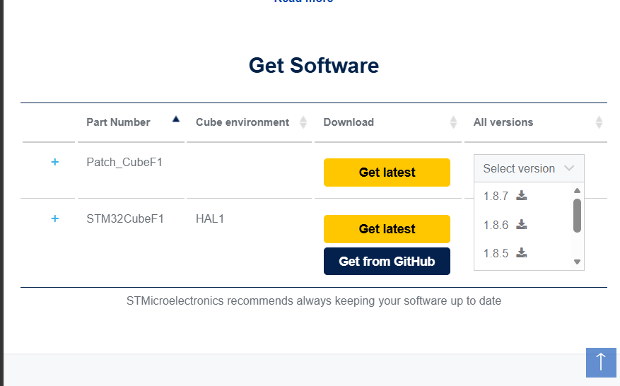

2. 搭建开发环境

   新建工程文件夹分为 2 个步骤：1，新建工程文件夹；2，拷贝工程相关文件。我们把这个文件夹重命名为：“新建工程实验-寄存器版本”。

   为了让工程的文件目录结构更加清晰易懂，我们会在工程根目录文件夹下建立以下几个文件夹，每个文件夹名称及其作用如表：

   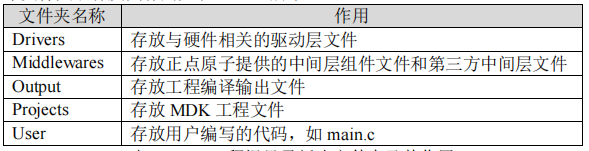

