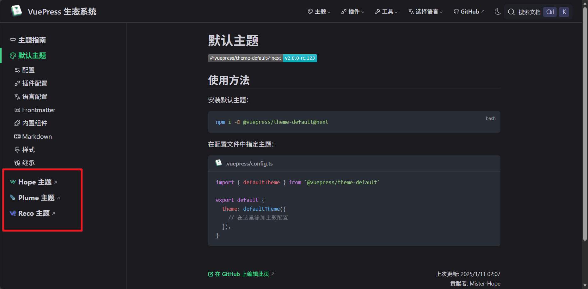

## 前言

接下来我将用最通俗易懂的语言，讲述一个最简单的免费的个人网站制作流程。内容包括环境搭建，仓库配置，构建网站，本地开发与测试，网站部署。我们选择静态网站生成器作为构建网站技术方案，在众多技术当中又选择了Vuepress 原因是以前我们学过Vue2 和 Node.js。

### 准备必备工具

- 注册一个GitHub账号 网址:https://github.com

- 安装Git版本控制工具 网址:https://git-scm.cn/

  

- 安装VS Code 代码编辑器

- 安装 Node.js 版本要 `20.19.0` 及以上但低于 `21.0.0` 的版本 或 `22.0.0` 及以上的版本 

  网址: https://nodejs.org/zh-cn

- 安装Typora Markdown 编辑器 网址:https://typoraio.cn/releases/stable.html
  

## VuePress介绍

VuePress 是一个以Markdown为重心的静态网站生成器。你可以使用Markdown来书写内容，然后VuePress会帮助你生成一个静态网站来展示它们。VuePress 提供了一个默认主题，主题代表的就是一个网站的整体风格，样式，设计。有很多社区用户创建了其它主题，并把它发布到网上。最具代表的有三个主题，分别是Hope主题，Plume主题，Reco主题。具体网址:https://ecosystem.vuejs.press/zh/themes/default/ 画面如下：



我个人是比较喜欢Plume主题的风格的，所以就以这个主题为例，开发一个个人网站。

## Plume 主题

### 主题介绍


网址:https://theme-plume.vuejs.press

如图所示，可以看到整个页面非常的炫酷，很美观可人。vuepress-theme-plume 是基于 VuePress 构建的现代化主题，无论您需要创建**技术博客**、**生活随笔**、**产品文档**、**知识库**还是**系列教程**，都能满足您的多样化需求。

### 安装与使用

1. ####  创建目录

   1. 可以手动创建一个文件夹，也可以用命令行创建一个文件夹

      ```cmd
      mkdir 文件夹名字
      cd 文件夹名字
      ```

      

2. ####  命令行安装

   使用如下命令，可快速搭建基础项目结构

   ```sh
   npm create vuepress-theme-plume@latest
   ```

   启动后只需回答几个简单问题即可完成配置：

   ```shell
   ┌  Welcome to VuePress and vuepress-theme-plume !
   │
   ◇  Select a language to display / 选择显示语言
   │  简体中文
   │
   ◇  您想在哪里初始化 VuePress？
   │  ./my-project
   │
   ◇  站点名称：
   │  My Vuepress Site
   │
   ◇  站点描述信息：
   │  My Vuepress Site Description
   │
   ◇  是否使用多语言？
   │  No
   │
   ◇  请选择站点默认语言
   │  简体中文
   │
   ◇  是否使用 TypeScript？
   │  Yes
   │
   ◇  请选择打包工具
   │  Vite
   │
   ◇  部署方式：
   │  Custom
   │
   ◇  是否初始化 git 仓库？
   │  Yes
   │
   ◇  是否安装依赖？
   │  Yes
   │
   ◇   🎉 创建成功!
   │
   └  🔨 执行以下命令即可启动：
         cd ./my-project
         pnpm run docs:dev
   ```

3. ####  项目结构 (看都不用看)

   ```
   ├── .git
   ├── docs		# 文档源目录
   │   ├── .vuepress	# VuePress 配置目录
   │   │   ├── public	# 静态资源
   │   │   ├── client.ts	# 客户端配置（可选）
   │   │   ├── collections.ts	# Collections 配置（可选）
   │   │   ├── config.ts	# VuePress 主配置
   │   │   ├── navbar.ts	# 导航栏配置（可选）
   │   │   └── plume.config.ts	# 主题配置文件（可选）
   │   ├── demo	# doc 类型 collection
   │   │   ├── foo.md
   │   │   └── bar.md
   │   ├── blog	# post 类型 collection
   │   │   ├── preview	# 博客分类
   │   │   │   └── markdown.md	# 分类文章
   │   │   └── article.md	# 博客文章
   │   └── README.md	# 站点首页
   …
   ├── package.json
   ├── pnpm-lock.yaml
   ├── .gitignore
   └── README.md
   ```

   

   

   

   

   

   

   

