## 一、前言

零基础也能拥有自己的个人网站，接下来我将用最通俗易懂的语言，讲述一个最简单的免费的个人网站制作流程。内容包括环境搭建，仓库配置，构建网站，本地开发与测试，网站部署,每个步骤我都尽可能讲的详细。本次搭建我们选择静态网站生成器作为构建网站技术方案，在众多技术当中又选择了Vuepress 原因是以前我们学过Vue2 和 Node.js。

### (一)、准备必备工具

- 注册一个GitHub账号 网址:https://github.com

- 安装Git版本控制工具 网址:https://git-scm.cn/

  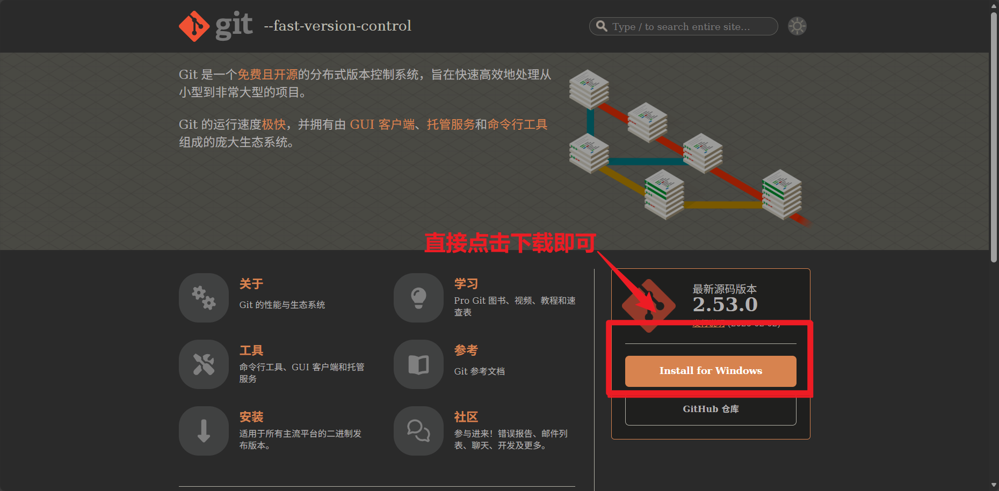

- 安装VS Code 代码编辑器

- 安装 Node.js 版本要 `20.19.0` 及以上但低于 `21.0.0` 的版本 或 `22.0.0` 及以上的版本 

  网址:  https://nodejs.org/zh-cn

- 安装Typora Markdown 编辑器 网址: https://typoraio.cn/releases/stable.html
  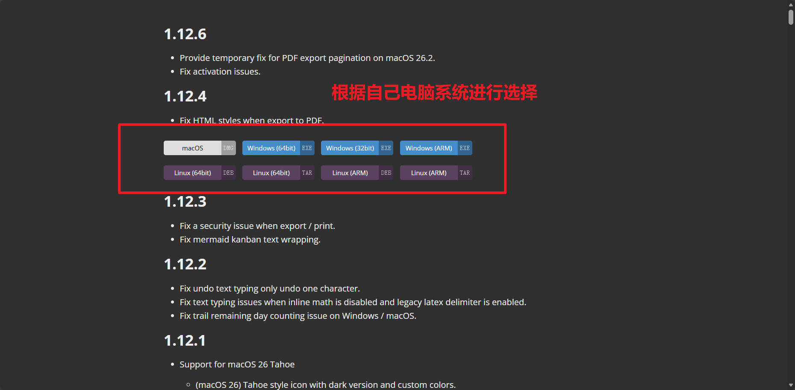

### (二)、VuePress介绍

VuePress 是一个以Markdown为重心的静态网站生成器。你可以使用Markdown来书写内容，然后VuePress会帮助你生成一个静态网站来展示它们。VuePress 提供了一个默认主题，主题代表的就是一个网站的整体风格，样式，设计。有很多社区用户创建了其它主题，并把它发布到网上。最具代表的有三个主题，分别是Hope主题，Plume主题，Reco主题。具体网址: https://ecosystem.vuejs.press/zh/themes/default/ 画面如下：

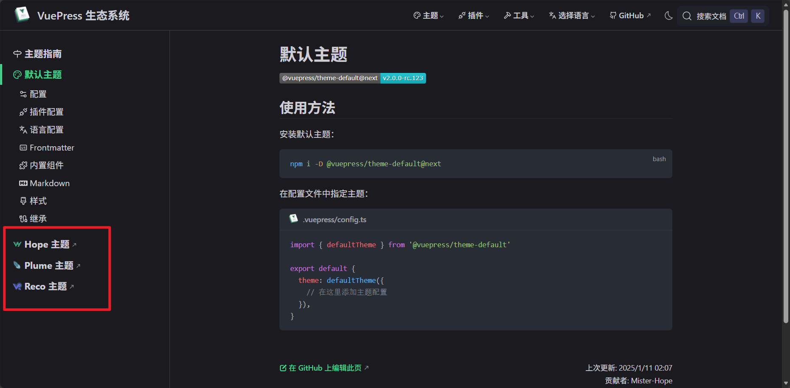

Hope主题 如下图所示：

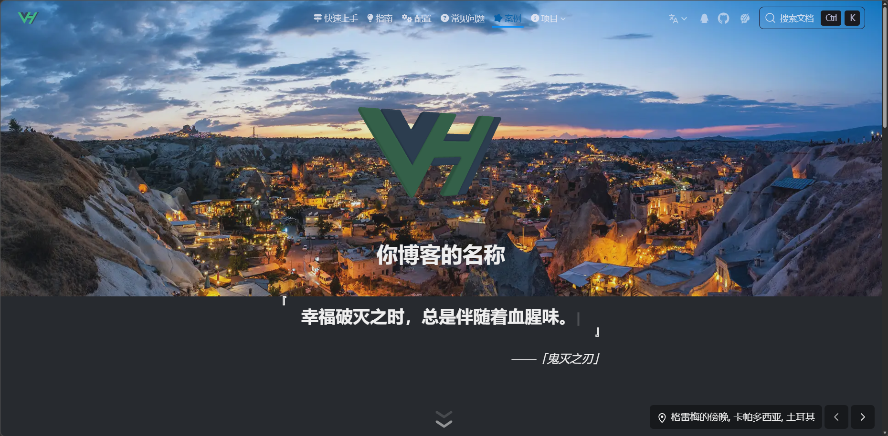

Plume主题 如下图所示

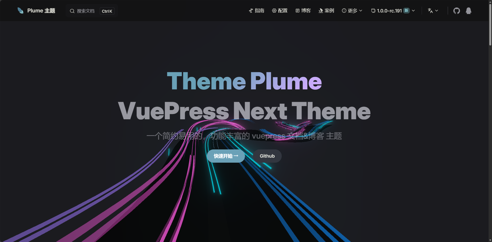

都挺好看的，看个人喜好选择，下面我就以Plume主题为例，开发一个个人网站。

## 二、Plume 主题

### (一)、主题介绍

官网地址: https://theme-plume.vuejs.press

如上图所示，可以看到整个页面非常的炫酷，很美观可人。vuepress-theme-plume 是基于 VuePress 构建的现代化主题，无论您需要创建**技术博客**、**生活随笔**、**产品文档**、**知识库**还是**系列教程**，都能满足您的多样化需求。

### (二)、安装

1. ####  命令行安装

   使用如下命令，可快速搭建基础项目结构

   ```sh
   npm create vuepress-theme-plume@latest 项目名称
   ```

   启动后只需回答几个简单问题即可完成配置：

   ```shell
   ┌  Welcome to VuePress and vuepress-theme-plume !
   │
   ◇  Select a language to display / 选择显示语言
   │  简体中文
   │
   ◇  您想在哪里初始化 VuePress？
   │  ./my-project
   │
   ◇  站点名称：
   │  我的站点名称
   │
   ◇  站点描述信息：
   │  我的站点信息描述
   │
   ◇  是否使用多语言？
   │  No
   │
   ◇  请选择站点默认语言
   │  简体中文
   │
   ◇  是否使用 TypeScript？
   │  No
   │
   ◇  请选择打包工具
   │  Vite
   │
   ◇  部署方式：
   │  Github pages
   │
   ◇  是否初始化 git 仓库？
   │  Yes
   │
   ◇  是否安装依赖？
   │  Yes
   │
   ◇   🎉 创建成功!
   │
   └  🔨 执行以下命令即可启动：
         cd ./my-project
         pnpm run docs:dev
   ```

   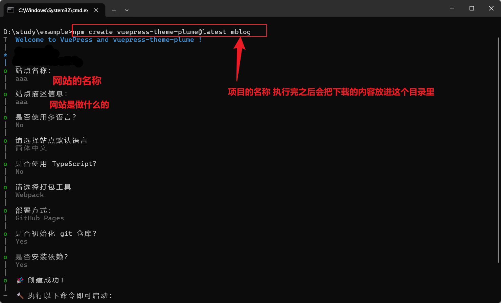

2. #### 启动

   (1)、安装好后会提示你如何启动，按照提示在cmd输入命令即可

   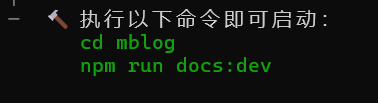

   (2)、启动后的效果

   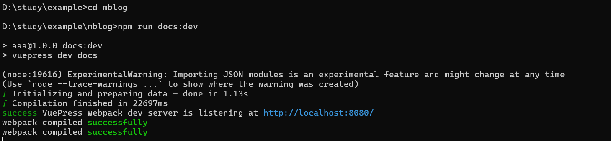

   (3)、ctrl＋鼠标左击 打开网址 画面如下
   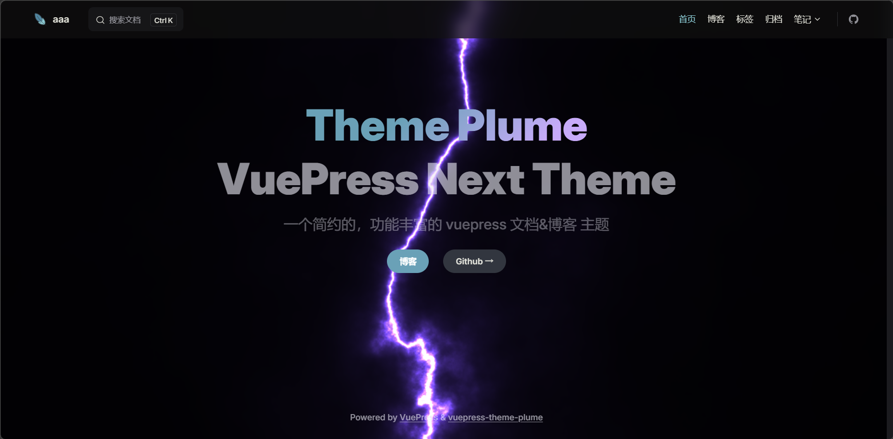

3. ####  项目结构 (了解即可)

   ```shell
   ├── .git
   ├── docs		# 文档源目录
   │   ├── .vuepress	# VuePress 配置目录
   │   │   ├── public	# 静态资源
   │   │   ├── client.ts	# 客户端配置（可选）
   │   │   ├── collections.ts	# Collections 配置（可选）
   │   │   ├── config.ts	# VuePress 主配置
   │   │   ├── navbar.ts	# 导航栏配置（可选）
   │   │   └── plume.config.ts	# 主题配置文件（可选）
   │   ├── demo	# doc 类型 collection
   │   │   ├── foo.md
   │   │   └── bar.md
   │   ├── blog	# post 类型 collection
   │   │   ├── preview	# 博客分类
   │   │   │   └── markdown.md	# 分类文章
   │   │   └── article.md	# 博客文章
   │   └── README.md	# 站点首页
   …
   ├── package.json
   ├── pnpm-lock.yaml
   ├── .gitignore
   └── README.md
   ```


### (四)、使用与配置

1. #### 首页配置

   在配置首页之前我们需要插播一条知识点，即Frontmatter。(看一看吧，看不懂有个眼缘也行)

   - ##### Frontmatter是什么？

     直译：**前页/前置元素** 是一种常用于静态站点生成器的编辑器技术。最常见的格式是**YAML**(以---开头和结尾) ，它能够自定义变量，静态站点生成器在构建网站时，会读取这些数据，并将其注入到页面模板中。如：模板文件会读取title变量，自动将其放到HTML的<title></title>标签中和页面的大标题位置。

   - ##### YAML核心规则

     - 大小写敏感
     - 缩进严格：必须使用空格，不能用Tab！！！！；同一层级的元素左侧必须对齐。
     - 注释用#，且只能用单行注释
     - 文件开始：可以用 `---` 表示一个文档开始，用 `---` 表示文档结束

   - ##### YAML核心数据结构

     - **标量**：标量是最基本的数据单元，可以是字符串、整数、浮点数、布尔值、Null、时间等。

       ```yaml
       # 字符串（一般不需要加引号）
       name: 张三
       # 带空格的字符串，建议加引号（单双引均可）
       city: 'New York'
       
       # 布尔值
       is_student: false
       is_employed: true
       
       # 数字
       age: 25
       
       # Null
       empty: null
       nil: ~        # 波浪号也表示 null
       
       # 日期时间（ISO 8601格式）
       date: 2023-10-27
       datetime: 2023-10-27T15:30:00+08:00  # 带时区
       ```

     - **对象**：键值对集合，用冒号 `:`分隔键和值

       ```yaml
       # 普通对象
       person:
         name: 李四
         age: 30
         address:
           city: 北京
           street: 长安街
       ```

     - **数组**：用连字符 `-` 表示列表项

       ```yaml
       # 普通列表
       hobbies:
         - 篮球
         - 游泳
         - 编程
       
       # 列表项可以是对象
       employees:
         - name: 王五
           age: 28
         - name: 赵六
           age: 32
       ```

   ##### (1) 参数讲解

   用Typora这个软件打开docs/README.md 配置首页站点，你会发现这个文件的最顶部有一坨灰色的东西，如图所示：

   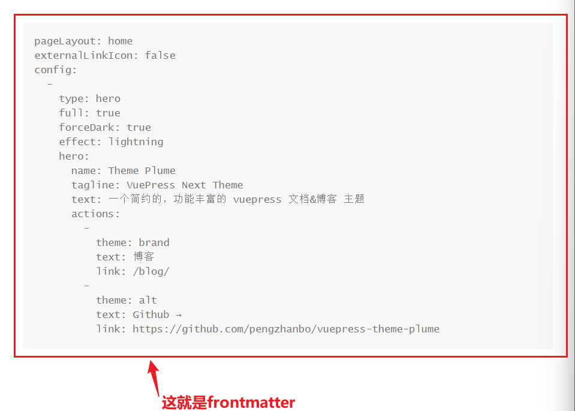

   以下是这些参数代表的含义：

   ①、pageLayout

   - 类型：`'home'`
   - 详情：声明当前页面为 首页。

   ②、externalLinkIcon

   - 类型：`false`
   - 详情：是否在 Markdown 文档中的外部链接旁边显示一个小图标，设置为 `false` 表示不显示。

   ③、config（首页配置项）

   - 类型：`array`（数组）
   - 详情：这是一个配置数组，用于定义首页上不同区块的内容和样式。数组中的每个对象代表一个独立的区块。

   ```yaml
   ---
   pageLayout: home        # 页面布局类型 home表示当前页面为首页布局
   externalLinkIcon: false # 是否显示外部链接图标 true显示，false不显示
   config:                 # 页面配置数组
     - type: hero         # 第一个区块类型：英雄区 页面最上方的大标题区域
       full: true         # 是否全宽显示
       forceDark: true    # 强制深色模式
       effect: lightning  # 特效类型 还有很多特效后续介绍
       hero:              # 英雄区内容配置
         name: Theme Plume      # 大标题
         tagline: VuePress Next Theme  # 副标题
         text: 一个简约的，功能丰富的 vuepress 文档&博客 主题  # 描述文字
         actions:         # 操作按钮
           - theme: brand      # 按钮主题样式
             text: 博客        # 按钮文字
             link: /blog/      # 按钮链接
           - theme: alt        # 另一种主题样式
             text: Github →    # 按钮文字
             link: https://github.com/pengzhanbo/vuepress-theme-plume  # 按钮链接
   ---
   ```

   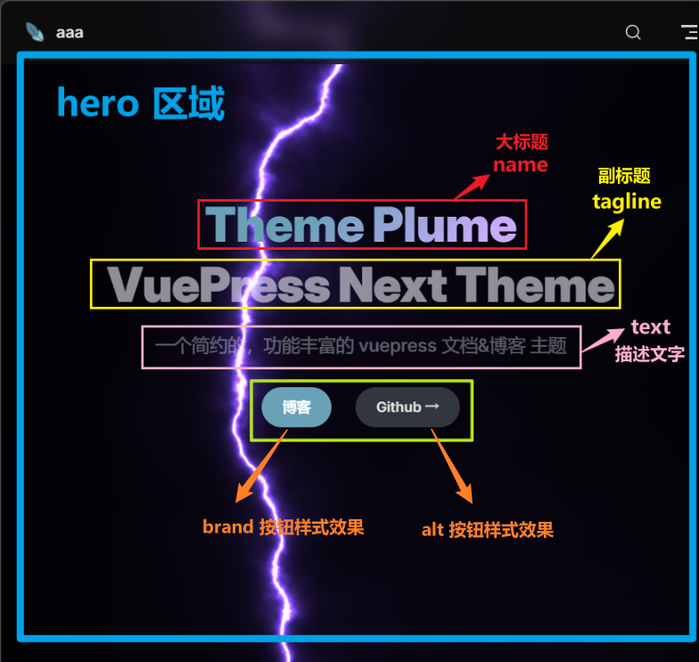

   ##### (2)配置说明

   ###### ① 顶层配置

   | 配置项             | 值      | 说明                                              |
   | :----------------- | :------ | :------------------------------------------------ |
   | `pageLayout`       | `home`  | 指定当前页面为首页布局                            |
   | `externalLinkIcon` | `false` | 是否在外部链接旁边显示 🔗 图标，`false` 表示不显示 |

   ###### ② config数组

   - **hero区块配置**

     | 配置项      | 值          | 说明                                                         |
     | :---------- | :---------- | :----------------------------------------------------------- |
     | `type`      | `hero`      | 英雄区类型，通常是页面最上方的大标题区域                     |
     | `full`      | `true`      | 是否全屏宽度显示，`true` 表示占满整个视口宽度                |
     | `forceDark` | `true`      | 强制使用深色模式，不受系统/主题设置影响                      |
     | `effect`    | `lightning` | 特效类型，目前支持： - `lightning`：闪电/粒子特效 - 可能还有其他特效值 |

   - **hero对象**

     | 配置项    | 值                    | 说明                              |
     | :-------- | :-------------------- | :-------------------------------- |
     | `name`    | `Theme Plume`         | 网站/品牌名称，通常是大号字体显示 |
     | `tagline` | `VuePress Next Theme` | 标语，显示在名称下方              |
     | `text`    | 一个简约的...         | 详细的描述文字                    |
     | `actions` | 数组                  | 操作按钮列表                      |

   - **actions按钮配置**

     | 配置项  | 值               | 说明                                                         |
     | :------ | :--------------- | :----------------------------------------------------------- |
     | `theme` | `brand` 或 `alt` | 按钮样式主题： - `brand`：品牌色（通常是主题主色） - `alt`：次要/备用样式 |
     | `text`  | 字符串           | 按钮上显示的文本                                             |
     | `link`  | URL              | 按钮点击后的跳转链接                                         |

   修改示范

   ```yaml
   ---
   pageLayout: home
   externalLinkIcon: false
   config:
     -
       type: hero
       full: true
       forceDark: false
       effect: lightning
       effectConfig:
         hue: 235
         xOffset: 0
         speed: 0.8
         intensity: 1
         size: 1
       hero:
         name: Trace - 痕迹
         tagline:  From Learning to Building
         text: 一路写下的，不只是笔记，而是成长的痕迹
         actions:
           -
             theme: brand
             text: 开始
             link: /blog/
           -
             theme: sponsor
             text: Github →
             link: https://github.com/freedom-thinking
     -
    ---
   ```

   ###### ③ 修改背景特效类型

   主题对 **首页** 的 **Hero** 部分，内置了一系列 **炫酷好看** 的背景效果， 通过简单的配置即可应用到你的站点首页中：

   - 强制深色模式

     大部分背景效果在深色模式下表现更加出色，因此建议开启深色模式以获得最佳体验。但对于部分文档，也许浅色模式才是你想要的，因此主题在 `hero` 中提供了 `forceDark` 选项，仅强制将首页强制变为深色模式，而不影响其他页面的颜色模式。

     ```yaml
     pageLayout: home
     home: true
     config:
      -
         forceDark: true
     ```

   - 背景动态效果

     - tint-plate

       效果预览

       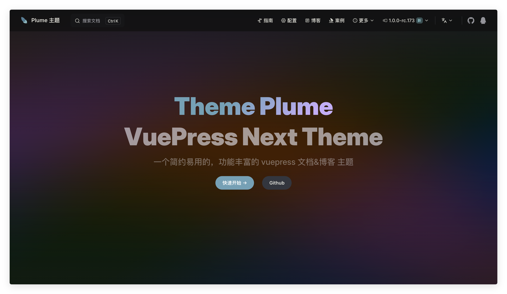

       使用方法

       ```yaml
       pageLayout: home
       home: true
       config:
        -
           type: hero
           full: true
           effect: tint-plate
       ```

       配置项

       配置为单个值时，表示配置 red,green,blue 三个颜色值为相同值，范围： 0 - 255。示例： `210`。

       配置为三个值时，表示配置 red,green,blue 三个颜色值为不同值，范围： 0 - 255。示例： `210,210,210`。

       配置为 `TintPlate`，则可以更加灵活的控制每个颜色值和对应的偏移量。

       还可以配置为 `{ light: TintPlate, dark: TintPlate }`，在深色模式和浅色模式下使用不同的颜色值。

     - prism

       预览效果

       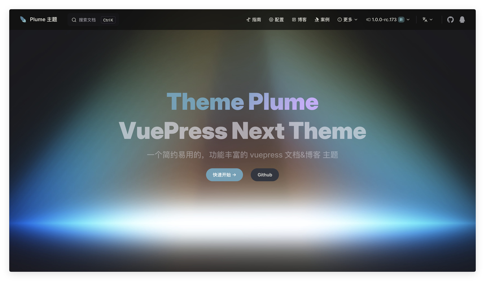

       安装依赖

       ```sh
       npm i ogl
       ```

       使用方法

       ```yaml
       ---
       pageLayout: home
       home: true
       config:
        -
           type: hero
           full: true
           effect: prism
       ---
       ```

     - pixel-blast

       预览效果

       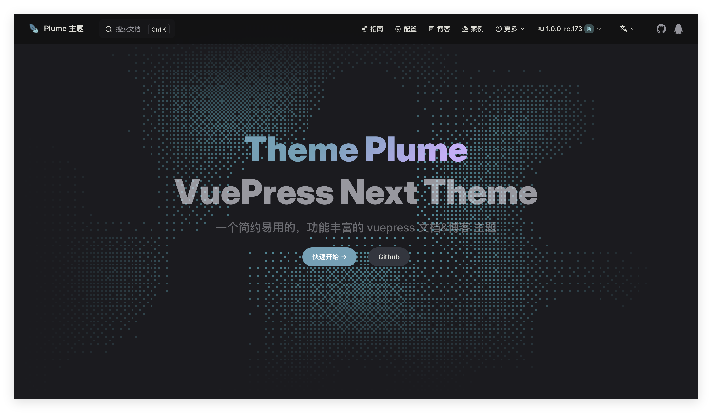

       安装依赖

       ```shell
       npm i three postprocessing
       ```

       使用方法

       ```yaml
       ---
       pageLayout: home
       home: true
       config:
        -
           type: hero
           full: true
           effect: pixel-blast
       ---
       ```

     - htper-speed

       效果预览

       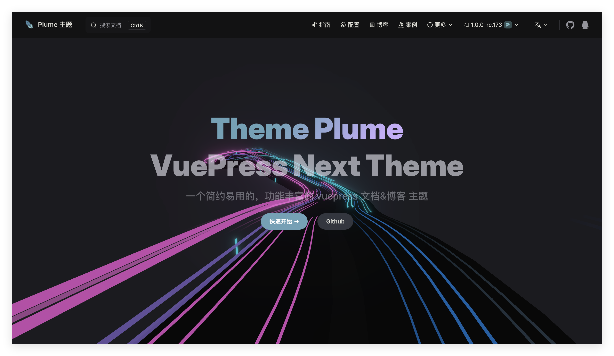

       安装依赖

       ```sh
       npm i three postprocessing
       ```

       使用方法

       ```yaml
       ---
       pageLayout: home
       home: true
       config:
        -
           type: hero
           full: true
           effect: hyper-speed
       ---
       ```

     - liguid-ether

       预览效果

       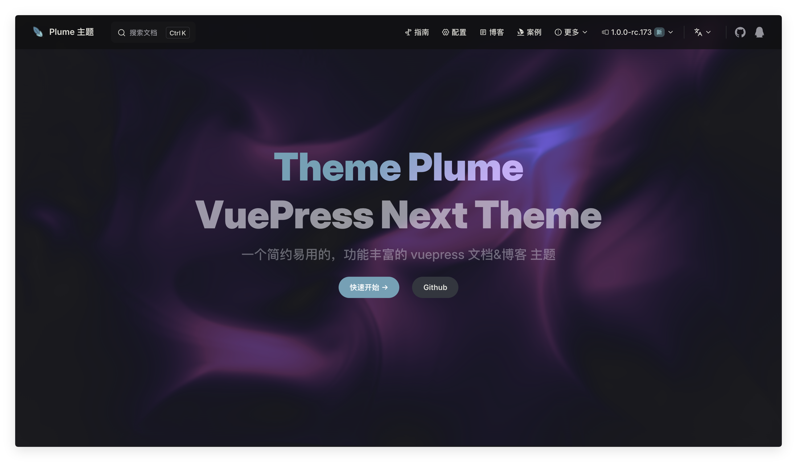

       安装依赖

       ```sh
       npm i three
       ```

       使用方法

       ```yaml
       ---
       pageLayout: home
       home: true
       config:
        -
           type: hero
           full: true
           effect: liquid-ether
       ---
       ```

       

2. 

